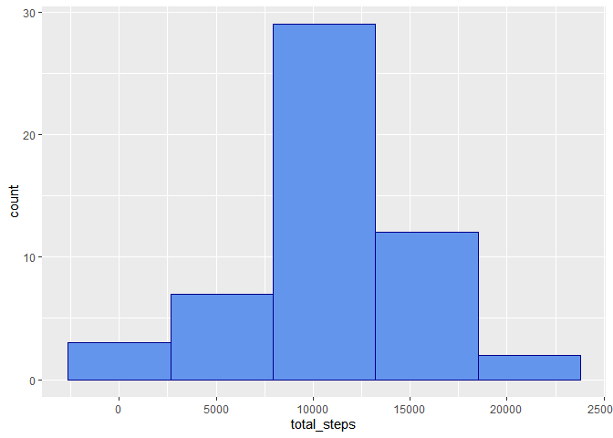
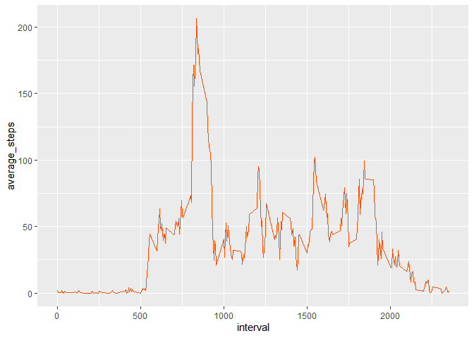
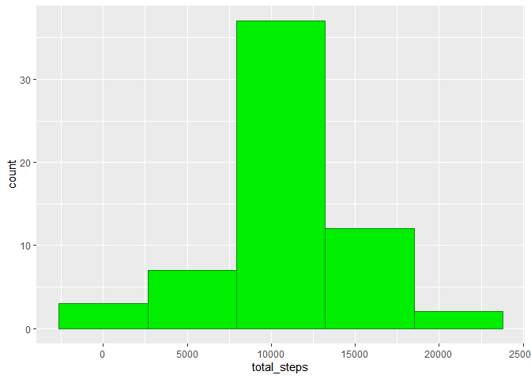
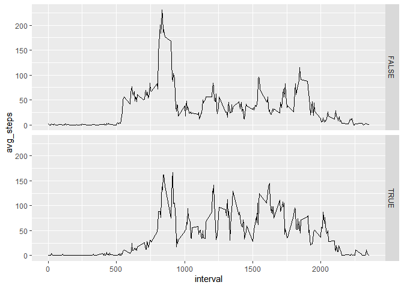

Reproducible Research, Project 1
================
S. Agatoni
May, 2020

### 0\. load required packages:

``` r
if(!require("pacman")) install.packages(pacman); library(pacman)
```

    ## Loading required package: pacman

    ## Warning: package 'pacman' was built under R version 3.6.3

``` r
pacman::p_load(ggplot2, dplyr, tidyr, chron, yaml)
```

### 1\. Code for reading in the dataset and/or processing the data:

``` r
data <- read.csv("activity.csv", header = TRUE)
data$date <- as.Date(data$date)
```

### 2\. Histogram of the total number of steps taken each day:

``` r
daily_sum <- na.omit(data) %>% 
  group_by(date) %>% 
  summarise(total_steps = sum(steps))

ggplot(data = daily_sum) + 
  geom_histogram(aes(total_steps), fill = "cornflowerblue", color = "darkblue", bins = 5)
```

<!-- -->

### 3\. Mean and median number of steps taken each day:

``` r
avg <- as.integer(mean(daily_sum$total_steps))
median <- median(daily_sum$total_steps)

print(avg)
```

    ## [1] 10766

``` r
print(median)
```

    ## [1] 10765

### 4\. Time series plot of the average number of steps taken (interval on x-axis):

``` r
per_int <- na.omit(data) %>% 
  group_by(interval) %>% 
  summarise(average_steps = mean(steps))

ggplot(data = per_int, aes(x = interval, y = average_steps)) + 
  geom_line(color = "#FC4E07") 
```

<!-- -->

### 5\. The 5-minute interval that, on average, contains the maximum number of steps:

``` r
max_int <- 
  per_int %>% 
  filter (average_steps == max(average_steps)) 

print(max_int$interval)
```

    ## [1] 835

### 6.Replacing missing data (steps) with the average steps per interval:

``` r
total_NA <- sum(is.na(data))
print(total_NA)
```

    ## [1] 2304

``` r
adj_data <- merge(data, per_int, by = "interval")

for (i in 1:nrow(adj_data)) {
  if (is.na(adj_data$steps[i])){
    adj_data$steps[i] <- adj_data$average_steps[i]
  }
}
```

``` r
adj_sum <- 
  adj_data %>% 
  group_by(date) %>% 
  summarise(total_steps = sum(steps))
  
new_avg <- as.integer(mean(adj_sum$total_steps))
new_median <- as.integer(median(adj_sum$total_steps))

print(new_avg)
```

    ## [1] 10766

``` r
print(new_median)
```

    ## [1] 10766

### 7\. Histogram of the total number of steps taken each day after imputing missing values:

``` r
ggplot(data = adj_sum) + 
  geom_histogram(aes(total_steps), fill = "green2", color = "green4", bins = 5)
```

<!-- -->

### 8\. Panel plot comparing the average number of steps taken per 5-minute interval across weekdays and weekends:

``` r
adj_avg <- adj_data %>%
  mutate (weekend = is.weekend(date)) %>%
  group_by(weekend, interval) %>%
  summarise(avg_steps = mean(steps))
```

``` r
ggplot(data = adj_avg) + 
  geom_line(aes(x = interval, y = avg_steps)) + 
              facet_grid(rows = vars(weekend)) 
```

<!-- -->
